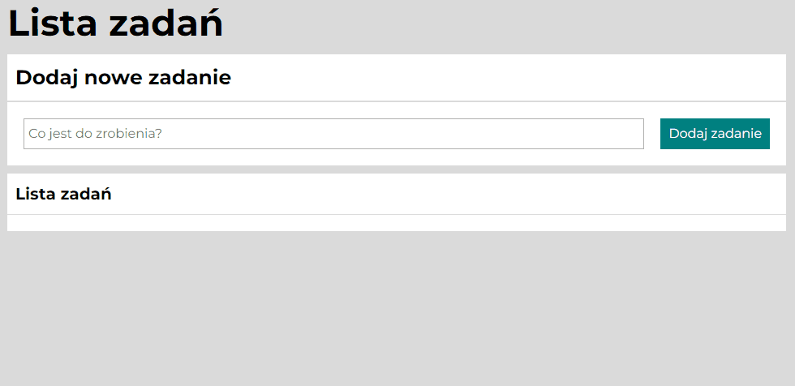

# Jakub Głuch - To do list

## Demo https://allmosthumann.github.io/to-do-list/

## Introduction

This is my third project made with <b>#YouCode course.</b> In next few months I will be gradually implement new features based on what I learnt during the course. 

Please follow me and see how I become Frontend dev! 

Ps: I'm strongly open for comments and suggestion!

Cheers!

## Description 

Simple to do list, with mobile devices responsiveness.

## Technologies
- BEM
- ES6
- Grid
- Flex

